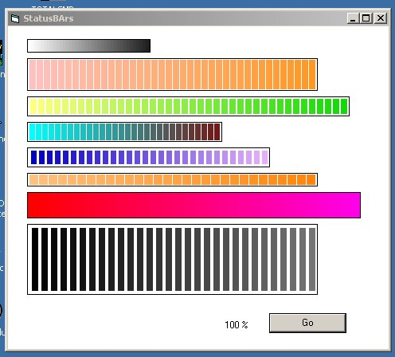



## Custom Colorized PROGRESSbar  :\-\)

### Description

A Colorized progressbar! Create OCX if u want to Use it. And please Vote:)

Sorry but my english isnt the best-)

Try it!
 
### More Info
 

             |
---                |---
**Submitted On**   |2004-08-08 13:52:46
**By**             |[lacasrac](https://github.com/Planet-Source-Code/PSCIndex/blob/master/ByAuthor/lacasrac.md)
**Level**          |Beginner
**User Rating**    |5.0 (10 globes from 2 users)
**Compatibility**  |VB 5\.0, VB 6\.0
**Category**       |[Graphics](https://github.com/Planet-Source-Code/PSCIndex/blob/master/ByCategory/graphics__1-46.md)
**World**          |[Visual Basic](https://github.com/Planet-Source-Code/PSCIndex/blob/master/ByWorld/visual-basic.md)
**Archive File**   |[Custom\_Col1780318102004\.zip](https://github.com/Planet-Source-Code/lacasrac-custom-colorized-progressbar__1-55481/archive/master.zip)

